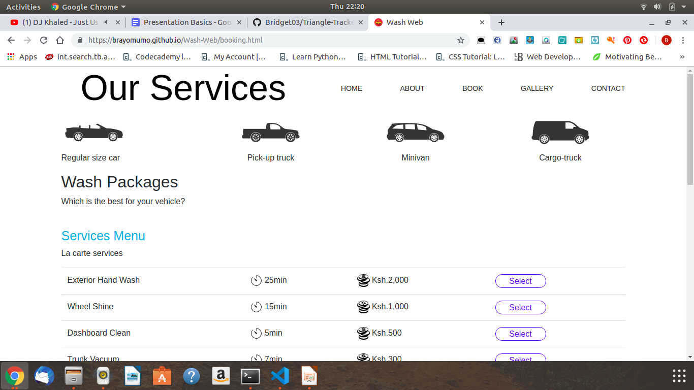

# CAR CLEAN
#### This application gives customers an online platform to book a time slot that is most appropriate for them to get their cars washed, 19/06/2019
#### By Emmanuel Muchiri
####    Brian Paul Mumo
####    Dennis Nyamweya
####    Mark Ian Mumba
####    Bridget Njoki
## Description
* Drivers log onto our page and to go the booking section and select the type of car they need washed.
 
* The type of car selected comes with a highlight of the services that will be performed by the car wash!
[Screenshot](./images/wash-packages.png) 
* The web page has more options that the consumer can choose from
[Screenshot](./images/services.png)
* The customer is also expected to fill out a form 'with his or her details.
[Screenshot](./images/contact2.png) 
* The page in turn sends the consumer a confirmation email for the booking
## Setup/Installation Requirements
* Create an account on Github
* Fork the repository from Github; https://brayomumo.github.io/Wash-Web/
* Clone the link above
* Open the repository where the link is saved in
## Known Bugs
There are no known bugs in the site.
## Technologies Used
* HTML and CSS
* Bootstrap
* Javascript
* jQuery
## Support and contact details
For any queries, comments or feedback, contact us via brayomumo5@gmail.com
### License
* MIT 
Copyright (c) 2019 CAR CLEAN
  